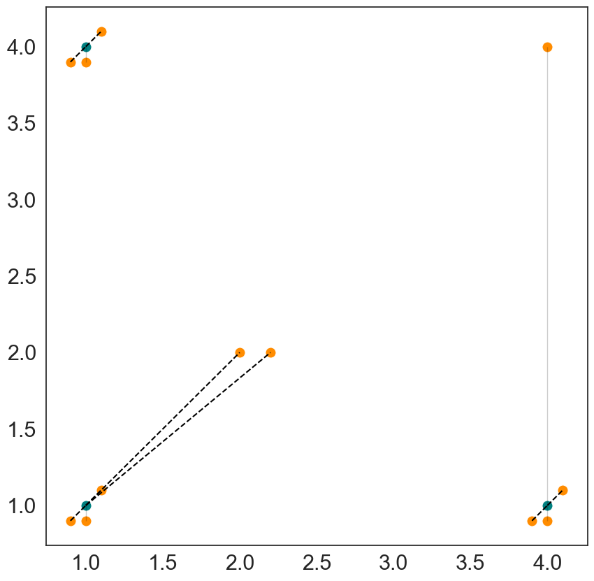

# MapReduce k-centers with outliers

Repository based on the course [Big data computing @ Unipd](https://didattica.unipd.it/off/2021/LM/IN/IN2371/002PD/INP7079233/G2GR2), we provide the implementation of a sequential k-means algorithm capable to deal with outliers. Moreover, we apply it on a coreset-based MapReduce strategy.

Note that the code is structured in such a way to use just a few, basic python modules (e.g. numpy, scipy), in order to make it easy to use in a distributed environment and to avoid portability issues.

Each alfgorithm is also provided with a simple and small test dataset.

# Installation 
To install pyspark on your local machine, please refer to the [official installation guide](https://spark.apache.org/docs/latest/installation.html) or [specific python instructions](http://www.dei.unipd.it/~capri/BDC/PythonInstructions.html).

# Overview
### k-centers with outliers:
**Standard version**

In [sequential](https://github.com/nicolezattarin/MapReduce-kcenters-outliers/tree/main/sequential) we develop a sequential algorithm to find the centers of clusters in presence of outliers.
Given a set P of points and two integers k and z, the model finds the k centers of clusters in P, with at most z outliers. A method to compute the loss function is also provided.
A 2 dimensional example follows:

  

**Optimized version**
Even tought the first version of the code is more intuitive, it is not the most efficient one. Nevertheless, to deal with big data, an algorithm must not only take care of memory, but also be fast. In [sequential_optimized](https://github.com/nicolezattarin/MapReduce-kcenters-outliers/tree/main/sequential_optimized) we provide the optimized version of the algorithm, in which the speed up is achieved by applying a dynamic programming approach.

