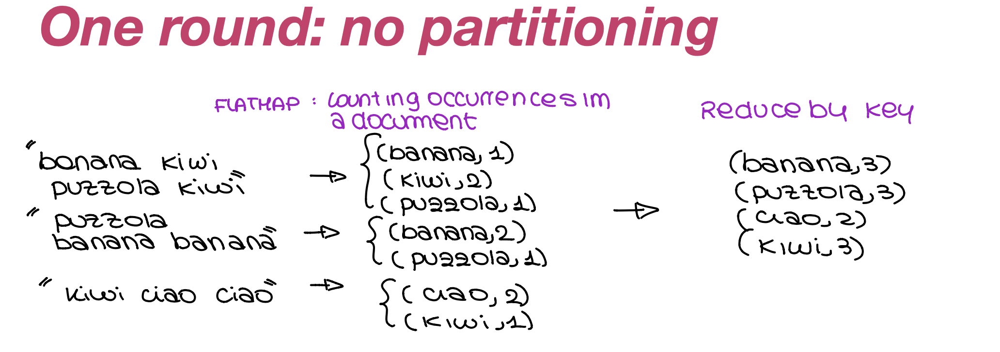
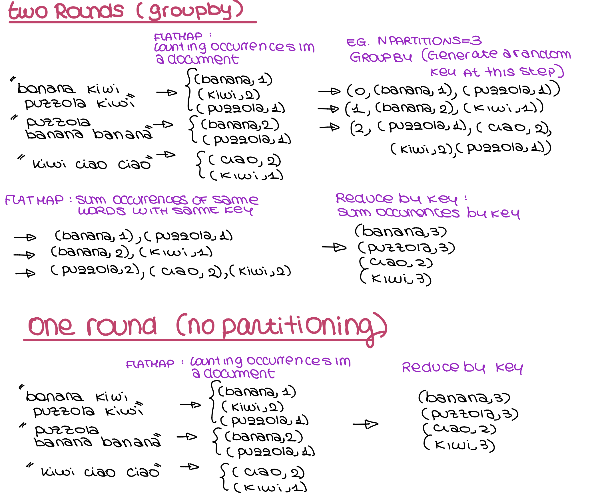

## Word counting in a text file
tester.py implements a function that, given a txt file containing words and the number of partitioning, counts the number of words in the file.

Different algorithms to perform the same task are provided in word_count.py.

In particular consider the following examples of applications on a trivial dataset:

 

 

